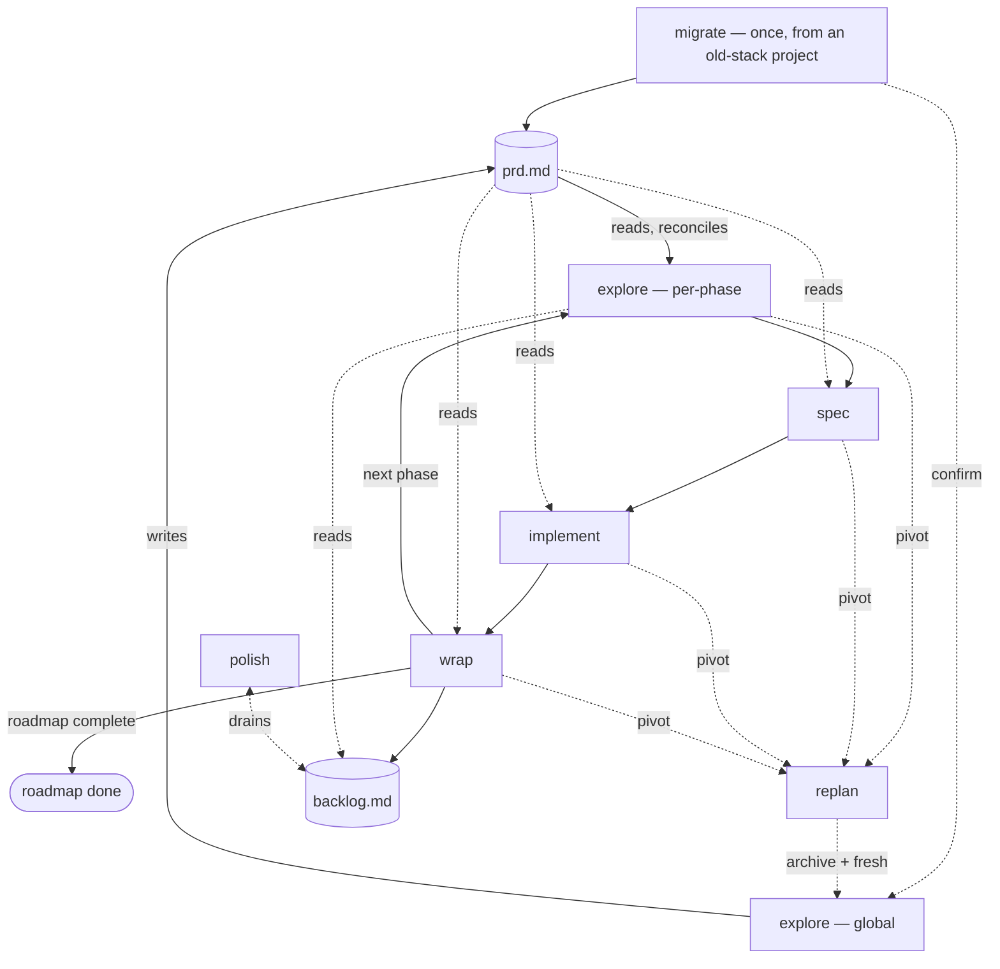

# ladder.md

20 words a sentence. 2 sentences a line. Read this first, in every skill, to see where you sit.

## Subagent tiers

Select a tier only when spawning a subagent. The parent session keeps its user-selected model.

- mechanical — Source collection and read-only checks. Codex Luna / medium; Claude Sonnet 5.
- standard — Bounded research and approved code tasks. Codex Terra / medium; Claude Sonnet 5.
- deliberate — Unclear prior art, first repairs, and ordinary reviews. Codex Terra / high; Claude Sonnet 5.
- flagship — Security, migration, concurrency, core data, public APIs, or three-system changes. Codex Sol / high; Claude Opus 5.
- exceptional — A stated risk remains after a direct flagship pass. Codex Sol / xhigh; Claude repeats Opus 5.

Claude has no reasoning-effort setting. A tier picks its Claude model only; the effort suffix applies to Codex alone.

A reviewer uses its writer's tier or higher. Select models only when you spawn the subagent.

Solid lines are the main loop. Dashed lines are on demand — a pivot, a drain, a one-time bridge.

Resuming after a break, or starting fresh? Load and follow `autobuild:autobuild` — it reads the project documents and hands off to whichever skill comes next.

Whatever's missing is next, build it, in this order.
