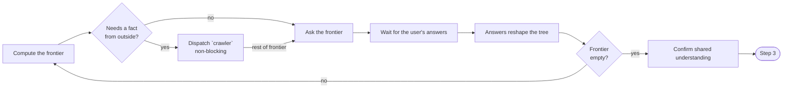

# Explore

Two modes.

Global runs once, for the whole product, and writes `prd.md`. Per-phase runs again, before each phase's spec work, and writes `spec/<phase>/user-stories.md`.

- Step: one unit of work.
- Gate: the check at the end of a step.
- Pass a gate → move to the next step.
- Fail a gate → redo the step, using the gate's findings.
- Fail the same gate twice → stop, ask the user.

Read `${CLAUDE_PLUGIN_ROOT}/ladder.md` first — it shows where this skill sits in the whole stack.

## Step 1 — Ground

Dispatch `crawler`. It finds 3 to 5 real comparable products, not the whole category — actual products people use today.

For each, it notes what it does well, what it does badly, and the gap it leaves. Wait for it before Step 2 starts.

Name the gap this idea could fill, from what it found. That gap grounds the interview, not a general impression of the market.

Per-phase mode also reads `prd.md` — the concept, north star, roadmap, and assumptions ground this phase's interview.

If a settled fact in `prd.md` no longer holds — the last phase shipped different from its roadmap line, an assumption proved false — correct it in place, now. This is a routine correction, not a pivot; a real change of direction belongs in `replan`, not here.

Per-phase mode also reads `backlog.md` at the project root, if one exists. It carries items a previous phase's wrap logged.

Gate: name at least 3 real comparable products, each with its gap.

Gate: per-phase mode only — `prd.md` matches current reality, or was corrected.

## Step 2 — Grill the shape

Map the interview tree for the shape only:

- Global mode: concept, north star, target users.
- Per-phase mode: this phase's goal, and the actors it serves.

Ask the frontier in one round. The frontier is every decision whose prerequisites are already settled.

Split the frontier before you ask it. Ask only felt decisions — ones the user would notice, wait on, or feel boxed in by.

Decide plumbing decisions yourself — ones the user would never notice either way. Record each as a settled fact, not a question.

An item raised but not settled this round may still have real value. Ask about it in this round; log it to `backlog.md` only if the user says yes.

Nothing with no future value gets written down at all.

Number each question. Give your recommended answer. Use this format:

> ❓ **Q1** - **<question title>**: <question body, may run multiple paragraphs, may include multiple choices>
>
> ➡️ <your recommended answer>

Dispatch `crawler` for any fact you'd otherwise ask the user. Never ask for one you could look up.

Keep dispatching it as new branches appear.

Gate: recompute the frontier — it returns zero items. Every shape item above is settled.

Name 2 to 6 decisions the interview never reached, that the draft still assumes. Route each as felt (ask now) or plumbing (record it).

The user says yes to the shared understanding.

## Step 3 — Shape

Write the settled shape, using only what it settled.

Record positive facts only. A negating word stating a capability — "never fails," "nothing to install" — is not an exclusion.

Global mode writes two things.

First, an announcement: what it does, who it is for, why it matters, in one paragraph — as if it already shipped.

Second, one sentence: for <user>, who <need>, this is a <kind of thing> that <key benefit>. Unlike <the closest alternative>, it <what's different>.

Per-phase mode writes one paragraph: what this phase delivers, and for whom.

If a sentence will not fill in cleanly, the tree is not actually settled yet. Go back to Step 2.

Gate: every claim traces to a settled decision, and nothing else does.

Gate: show it to the user. Get their approval.

Write it to disk now, before Step 4.

Global mode writes concept, north star, and target users into `prd.md`. Per-phase mode writes the paragraph as the Scope section of `spec/<phase>/user-stories.md`.

A crash after this point does not lose the shape.

Gate: the shape's section exists on disk, and matches what was approved.

## Step 4 — Grill the features

Map the interview tree for everything the shape left open:

- Global mode: user stories, functional requirements, non-functional requirements, assumptions and constraints, roadmap, when it is done.
- Per-phase mode: this phase's user stories, in full.

Ask this frontier the same way — one round, split felt versus plumbing, looped until it's empty.

Per-phase mode folds in one question per backlog item:

- bring it into this phase
- propose it as a new roadmap phase
- leave it for later

Dispatch `crawler` for any fact you'd otherwise ask the user. Never ask for one you could look up.

Keep dispatching it as new branches appear.

Gate: recompute the frontier — it returns zero items. Every section above has one settled decision behind it.

Name 2 to 6 decisions the interview never reached, that the draft still assumes. Route each as felt (ask now) or plumbing (record it).

The user says yes to the shared understanding.

## Step 5 — Write

Write the rest of `prd.md` from the settled tree, following `schemas/prd.md`. Concept, north star, and target users are already there from Step 3.

Record positive facts only. A negating word stating a capability — "never fails," "nothing to install" — is not an exclusion.

Per-phase mode appends the stories to `spec/<phase>/user-stories.md`, following `schemas/user-stories.md`. The Scope section is already there from Step 3.

A feature-phase item approved in Step 4 gets appended to `prd.md`'s Roadmap section, as a new phase.

Gate: count the sections — all nine are present. Check the tree line by line against the draft — every settled decision appears once.

Gate: show the doc to the user. Get their approval.

## Step 6 — Close

Run `${CLAUDE_PLUGIN_ROOT}/scripts/update-state.py`. Set up the remote. Commit.

Per-phase mode also closes any folded-in backlog item — rewritten down to its closed form, not deleted — and commits that too.

Gate: the state script ran clean. The commit succeeded.

Gate: per-phase mode only — every folded-in item is closed in `backlog.md`, none left open.

## Gate

Build only from the steps above.

Gate on this run's doc — `prd.md` for global, `spec/<phase>/user-stories.md` for per-phase. Spawn a blind agent — it sees only that doc, never the interview. It checks:

- Every branch of the design tree appears in the doc.
- Every user story names an actor and an outcome, not a general capability.
- Global mode only: every section is present, grounded in a settled decision.
- Global mode only: every "When is done" criterion is checkable, and names a real motivation.
- Per-phase mode only: an approved feature-phase item appears once in `prd.md`'s Roadmap.
- No sentence in the doc excludes or forbids something. "Never fails" and "nothing to install" state a fact, not an exclusion.

Pass moves straight to `autobuild:spec` — call the Skill tool with that id. Fail returns to Step 3 with the findings.

Fix what it finds, once, then move on — it never runs a second time to confirm. Ask the user only if a finding itself is unclear.
