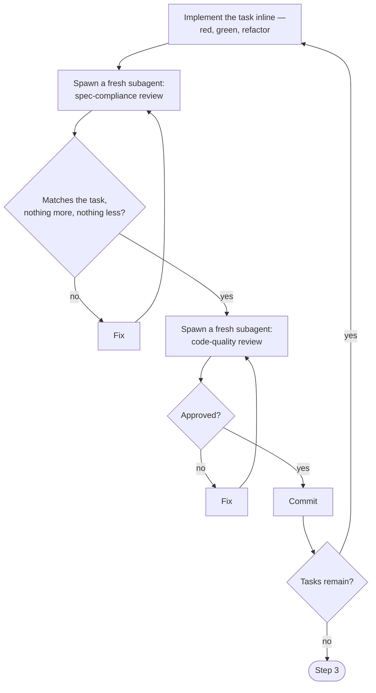

# Implement

Per phase only. Reads `spec/<phase>/contract.md`, `spec/<phase>/features.md`, `spec/<phase>/design-brief.md`, `spec/<phase>/user-stories.md`, and `prd.md` — never another phase's `spec/`.

- Step: one unit of work.
- Gate: the check at the end of a step.
- Pass a gate → move to the next step.
- Fail a gate → redo the step, using the gate's findings.
- Fail the same gate twice → rule on it yourself, and keep going. Log the ruling, and its cost if you're wrong, in the fix's commit message.
- Stop and ask the user only for:
  - an irreversible or destructive action
  - a security-sensitive action
  - an action outside this workspace — merge, push, publish
  - a plan too broken to guess a path through

Read `${CLAUDE_PLUGIN_ROOT}/ladder.md` first — it shows where this skill sits in the whole stack.

## Step 1 — Plan

Enter plan mode.

Map the files first: which files get created, which get modified, and the one job each file does.

Break the work into tasks. Each task is one small file group, and can be finished and committed on its own.

Write every task in full — the exact paths, the real test code, the exact command, and its expected result. Never write "add error handling," "similar to Task N," or "TBD."

Check the plan against the contract, line by line: does every endpoint, rule, and field map to a task? Check every task's names and types against every other task: the same field or function must read the same everywhere.

Gate: grep the plan for "TBD", "TODO", "similar to", or "add appropriate" — zero hits.

Gate: every contract line maps to a task, checked one by one.

Exit plan mode. This is the plan's approval gate.

Follow `docs/git-workflow.md` to create this phase's branch and worktree, before Step 2 starts.

Once approved, write the plan to `spec/<phase>/plan.md`, following `schemas/plan.md` — the plan-mode file does not survive past this session.

Record positive facts only. A negating word stating a capability — "never fails," "nothing to install" — is not an exclusion.

Gate: `spec/<phase>/plan.md` exists, and matches the approved plan.

Spawn a blind agent — it sees only `spec/<phase>/plan.md`, `spec/<phase>/contract.md`, and `spec/<phase>/features.md`, never this session's planning conversation. It checks completeness, spec alignment, task decomposition, and buildability:

- Every contract line maps to a task.
- Every function in `features.md` is honored by some task — what the user approved is what gets built.
- Every task matches the contract — nothing invented, nothing missing.
- Each task is small, ordered, and can finish and commit on its own.
- Every task's test, run, and commit fields are concrete, not descriptive.

Gate: the blind reviewer finds nothing to flag, or every finding is fixed and it runs again.

## Step 2 — Build

For each task, in order:

Resuming after a break? Check `plan.md`'s tasks against the branch's git log — a task whose commit message is already there is done.

Start from the first task that isn't.

Batch two or more small, same-shape tasks into one dispatch — one implement-review cycle, not one per task. A task with a real design decision or cross-file risk still gets its own cycle.

Before writing a task's test, name the break: the exact production change that would make it fail. Confirm that change is a bug, not a design decision you're free to make differently.

Follow one method for every task:

- Write one failing test. Watch it fail for the stated reason.
- A test waiting on async state polls the real condition — never a fixed sleep.
- Write the smallest code that passes. Watch this task's own tests pass, clean.
- Refactor only while green. Add no new behavior.

Step 2 never reruns the full suite — that cost belongs to Step 3, once, at the end.

A test proves nothing if its expected value comes from the same code under test. Compute it by hand instead.

Test your own boundary, not a library's or a framework's — its own tests already cover that.

A test that only breaks when someone changes an intentional constant is a change detector, not a test. Test the behavior the constant drives instead.

Before a task's tests count as done, mutate the code once. Try a wrong constant, a wrong branch, an empty or default return, a skipped edge case.

Gate: every mutation you tried made at least one test fail. An uncaught mutation means the behavior is unprotected, or the test is hollow.

Never review your own code. Point each reviewer at task N's block in `plan.md` and the diff, by file path — never paste either into the prompt.

Neither reviewer re-runs the suite themselves. If something looks wrong, it runs one focused test — never the whole suite.

The spec-compliance reviewer trusts nothing you report. It reads the diff against the task's own text, and flags anything missing or extra.

The code-quality reviewer runs only after spec compliance passes. It checks:

- the tests exercise real behavior, not a mock
- errors are handled
- the diff didn't grow a file beyond the plan's intent
- access control is enforced at every entry point, not assumed
- no injection risk in any user-supplied value
- any new dependency is a real, maintained package

A task's review loop runs up to 5 rounds. Rounds 1 to 3 resume the same implementer — it already has full context.

Rounds 4 and 5 hand the task to a fresh implementer, on a stronger model. It's told plainly how many attempts came before.

Round 5 failing is the plan's own defect, not a 6th attempt — that's one of the hard stops above.

Gate: no open review findings remain, on any task. Every diff matches only the task it belongs to.

## Step 3 — Verify

Run the full test suite now, fresh — not a memory of an earlier run. Read the exit code.

A test failing here is a regression, not a RED step — trace it to its root cause. Check every layer the bad value passes through, not just where it surfaced.

Check the contract line by line against the code:

- every endpoint is reachable
- every business rule has a passing test
- every edge case from the contract is covered

Gate: zero tests fail. Every contract line is accounted for in the code.

## Step 4 — Close

Run `${CLAUDE_PLUGIN_ROOT}/scripts/update-state.py`. Commit `state.json`.

Gate: the state script ran clean. The commit succeeded.

## Gate

Build only from the steps above.

Gate on the phase's full diff against `spec/<phase>/contract.md`.

Spawn a blind agent — it sees only the contract and the diff, never the plan or the interview. It checks:

- Every business rule in the contract has a test that passes.
- Every endpoint in the contract works end to end.
- Nothing in the diff is missing from the plan, or added beyond it.

Pass moves straight to `autobuild:wrap` — call the Skill tool with that id. Fail returns to Step 2 with the findings.

Fail this gate twice → rule on it yourself, and keep going. Log the ruling, and its cost if you're wrong, in the fix's commit message.
