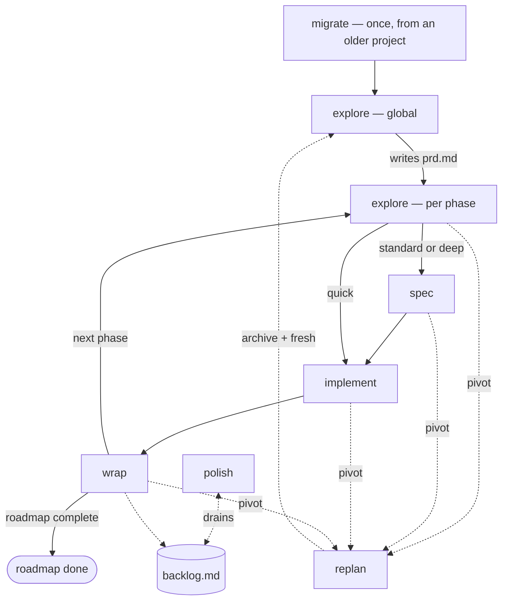

# stack.md

20 words a sentence. 2 sentences a line. Every skill reads this first. It holds what every skill shares.

## How a skill runs

- Step: one unit of work.
- Gate: the check at the end of a step.
- Pass a gate → move to the next step.
- Fail a gate → redo the step, using the gate's findings.
- Fail the same gate twice → stop, ask the user. Implement's own stop rules replace this line.

The user reviews last. Show the user a finished doc for approval only after every review of it passed. A later fix that changes its meaning goes back to the user.

Resolve every `../../` path from the skill's `SKILL.md`, against `${CLAUDE_PLUGIN_ROOT}`.

Read the project's `writing-rule.md` before writing any doc. Scaffold it from `../../templates/writing-rule.md` when missing.

Every doc a skill writes follows its template in `../../templates/`.

Do not invent product limitations. Write a limit only when the user stated it or research proved it, and name its scope.

A hand-off names the next skill's qualified id, `autobuild:<name>`, and calls the Skill tool with it in the same turn.

## The loop

Solid lines are the main loop. Dashed lines run on demand — a pivot, a drain, a one-time bridge.

Resuming after a break, or starting fresh? Load `autobuild:autobuild`. It reads the project docs and hands off to the next skill.

## Tracks

Every phase runs one track. Explore proposes it from the phase's stories, and the user confirms it.

- quick — changes existing screens or rules, adds no new data entity, and fits one small plan. Runs explore, implement, wrap. Spec is skipped.
- standard — everything between quick and deep. Spec writes the contract, plus design only when a screen changes.
- deep — touches security, money, existing user data, concurrency, a public API, or the product's core promise. Runs every step of every skill.

The track is recorded in `user-stories.md`. Every later skill reads it there. The user can change it at any gate.

## Docs

Living docs always state the product as it is today. Every skill that changes the product rewrites them before it closes:

- `prd.md` — intent, principles, and roadmap status
- `product.md` — what runs now: screens, data, interfaces, look
- `backlog.md` — open and closed items
- `changelog.md` — what shipped, newest first
- `README.md` and `docs/` — how to run and use the product

Snapshot docs record one phase, on the day it was written. Everything under `spec/<phase>/` is a snapshot. Date it, and never revise it after its phase ships.

A skill reads the living docs and the current phase's own snapshots. It never reads another phase's `spec/<phase>/`. A missing `product.md` is written by the next Wrap or Polish.

## Subagent tiers

Select a tier only when spawning a subagent. The parent session keeps its user-selected model. A tier sets the model, and nothing else.

- mechanical — Source collection and read-only checks. Sonnet 5.
- standard — Bounded research and approved code tasks. Sonnet 5.
- deliberate — Unclear prior art, first repairs, and ordinary reviews. Sonnet 5.
- flagship — Security, migration, concurrency, core data, public APIs, or three-system changes. Opus 5.
- exceptional — A stated risk remains after a direct flagship pass. Opus 5.

A reviewer uses its writer's tier or higher.

## Git

Implement's Plan step creates the phase's branch, before Step 2 starts:

- Branch name: `phase-<N>-<slug>`, from the phase's own directory name under `spec/`.
- Base branch: the exact branch recorded in `plan.md` before the phase branch is created.
- All of Implement's and Wrap's work for this phase happens on that branch.

Wrap's Finish step decides the branch's fate:

- Merge: merge the complete phase branch into its recorded base. Keep its history.
- Pull request: push the complete phase branch. Open a pull request without merging locally.
- Keep as-is: leave the branch alone.
- Discard: require typed `discard`, then drop the branch.
